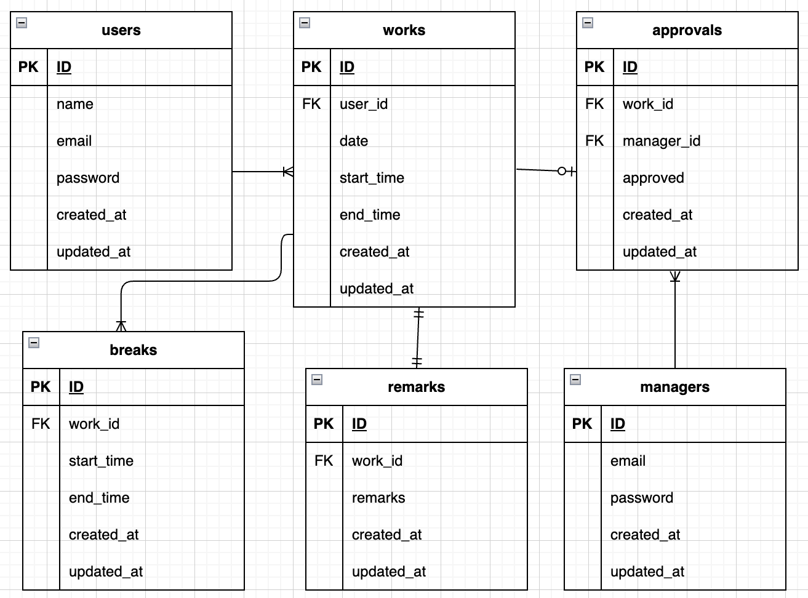

# kintai-app

## アプリケーション名
勤怠

## プロジェクトの概要
このプロジェクトは、勤怠の登録を行う勤怠アプリケーションです。
スタッフと管理者に分かれており、それぞれできることが違います。

- スタッフ：
    - ユーザー登録（メール認証）
    - ログイン
    - 勤怠登録（出勤・休憩入り・休憩戻り・退勤）
    - 勤怠一覧画面の閲覧
    - 勤怠時間の修正申請
    - 申請画面の閲覧

- 管理者：
    - ログイン
    - 勤怠一覧画面の閲覧
    - 勤怠時間の修正
    - スタッフ一覧の閲覧
    - スタッフ別勤怠のCSV出力
    - 申請画面の閲覧・承認

## 環境構築

### Dockerビルド

1. 任意のディレクトリを作成して移動
    mkdir 任意のディレクトリ名
    cd 任意のディレクトリ名

2. リポジトリをクローンしてディレクトリ名を変更
    git clone git@github.com:aya1204/kintai-app.git test

3. `test`ディレクトリへ移動
    cd test

4. Dockerビルド・起動
    docker-compose up -d --build

### Laravel環境構築

1. PHPコンテナに移動してLaravelのパッケージのインストール
    docker-compose exec php bash
    composer install
    exit

2. mysqlにログインする
    docker-compose exec mysql bash
    mysql -u root -p
    # パスワードを聞かれたら `root` のパスワードを入力

3. 新しいデータベースに権限を付与する
    CREATE DATABASE laravel_test_5 CHARACTER SET utf8mb4 COLLATE utf8mb4_unicode_ci;
    CREATE USER 'laravel_test_user5'@'%' IDENTIFIED BY 'laravel_test_pass';
    GRANT ALL PRIVILEGES ON laravel_test_5.* TO 'laravel_test_user5'@'%';
    FLUSH PRIVILEGES;
    exit
    exit

4. PHPコンテナにログインして、'.env.example'の内容をコピーして'.env'を作成（設定ファイルのテンプレートを複製）
    docker-compose exec php bash
    cp .env.example .env

5. .envファイルを編集し、以下の環境変数を設定してください。
※記載がない場合、アプリケーションが正しく動作しない可能性があります。
    DB_HOST=mysql
    DB_DATABASE=laravel_test_5
    DB_USERNAME=laravel_test_user5
    DB_PASSWORD=laravel_test_pass
    MAIL_FROM_ADDRESS=example@example.com

6. APP_KEYを作成
    php artisan key:generate

※ `.env` の内容を編集してから、必ず `php artisan key:generate` を実行してください。

7. マイグレーションとシーディングを実行する
    php artisan migrate --seed
    exit

## 画像保存
### 1. 画像ディレクトリを作成し、商品画像を保存
    mkdir ./src/storage/app/public/images

    画像は下記URLよりダウンロードの上、`src/storage/app/public/images`フォルダに保存してください。
※ ファイル名は必ず指定された名前で保存してください。

    - [logo.svg](https://www.dropbox.com/scl/fi/3lldzhq91bo2ytzkel6nf/logo.svg?rlkey=b5185j7e9pmpmdb965f49h3ye&st=4sgoqg8q&dl=0)
    - [calendar-logo.png](https://www.dropbox.com/home?preview=calendar-logo.png)
    - [arrow.png](https://www.dropbox.com/home?preview=arrow.png)

### 2. PHPコンテナ内に移動して、ストレージに公開アクセスするためのシンボリックリンクを作成
    docker-compose exec php bash
    php artisan storage:link
    exit

## 単体テスト環境構築
### 1. MySQLにログインする
    docker-compose exec mysql bash
    mysql -u root -p
    root

### 2. MySqlコンテナ内でkintai_app_testデータベースを作成
    CREATE DATABASE kintai_app_test;
    SHOW DATABASES;
    (kintai_app_testが表示されたらOK)
    exit
    exit

### 3. PHPコンテナ内で.env.testingファイルを作成
    docker-compose exec php bash
    cp .env .env.testing

### 4. 作成できたら編集する
    APP_ENV=testing
    APP_KEY=
    DB_CONNECTION=mysql_test
    DB_DATABASE=kintai_app_test
    DB_USERNAME=root
    DB_PASSWORD=root

### 5. APP_KEYに新たなテスト用のアプリケーションキーを加える
    php artisan key:generate --env=testing

### 6. キャッシュの削除をしてテストをする
    php artisan config:clear
    php artisan make:test 〇〇Test
※スタッフと管理者でディレクトリを分けているので`staff/`または`admin/`を使い分けてください

## 使用技術（実行環境）
- PHP 7.4.9 (Dockerコンテナ内)
- Laravel 8.83.29
- Mailhog (ローカル環境のメール確認ツール)
- Composer version 2.8.5
- MySQL 8.0.26

## メール認証について
本アプリではユーザー登録後、メール認証を行うことでログインが完了します。
ローカル開発環境では Mailhog を使用し、 http://localhost:8025 またはメール認証誘導画面「認証はこちらから」ボタンで確認可能です。

## ER図
- users ↔︎ works：１対多
- users ↔︎ request_works：１対多
- works ↔︎ breaks：１対多
- works ↔︎ requests：１対0または１
- request_works ↔︎ request_breaks：１対多
- request_works ↔︎ requests：１対１
- request_breaks ↔︎ requests：多対１
- managers ↔︎ requests：１対多

※ ER図が表示されない場合は `docs/kintai-app-er.png` を直接開いてください。

## URL
- ローカル環境：http://localhost
- Githubリポジトリ：https://github.com/aya1204/kintai-app.git
- 【スタッフ】会員登録：http://localhost/register
- 【スタッフ】ログイン：http://localhost/login
- 【スタッフ】出勤登録画面：http://localhost/attendance
- 【スタッフ】勤怠一覧画面：http://localhost/attendance/list
- 【スタッフ】申請一覧画面：http://localhost/stamp_correction_request/list
- 【スタッフ】メール認証誘導画面：http://localhost/email/verify
- 【管理者】ログイン画面：http://localhost/admin/login
- 【管理者】勤怠一覧画面：http://localhost/admin/attendances
- 【管理者】スタッフ一覧画面：http://localhost/admin/users
- 【管理者】申請一覧画面：http://localhost/admin/requests

## 初期ログイン情報（シーディングで登録済み）

初期データとして以下のユーザーが登録されています。

### 管理者ユーザー
- メールアドレス：`admin@example.com`
- パスワード：`password`

### スタッフユーザー
- 名前：`山田 太郎`
- メールアドレス：`taro.y@coachtech.com`
- パスワード：`password`

- 名前：`西 怜奈`
- メールアドレス：`reina.n@coachtech.com`
- パスワード：`password`

- 名前：`増田 一世`
- メールアドレス：`issei.m@coachtech.com`
- パスワード：`password`

- 名前：`山本 敬吉`
- メールアドレス：`keikichi.y@coachtech.com`
- パスワード：`password`

- 名前：`秋田 朋美`
- メールアドレス：`tomomi.a@coachtech.com`
- パスワード：`password`

- 名前：`中西 教夫`
- メールアドレス：`norio.n@coachtech.com`
- パスワード：`password`