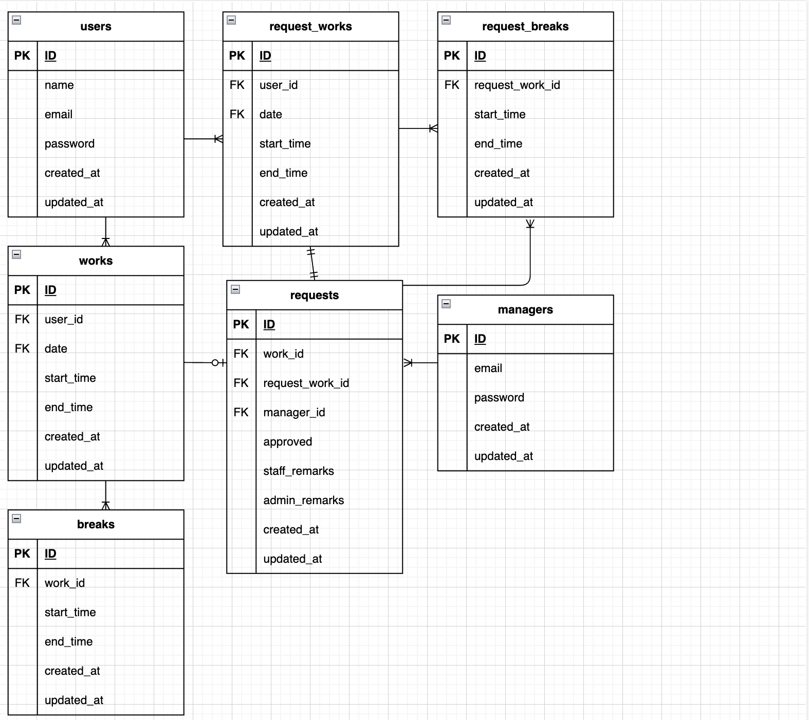

# kintai-app

## アプリケーション名
勤怠

## プロジェクトの概要
このプロジェクトは、勤怠の登録を行う勤怠アプリケーションです。
スタッフと管理者に分かれており、それぞれできることが違います。

- スタッフ：
    - ユーザー登録（メール認証）
    - ログイン
    - 勤怠登録（出勤・休憩入り・休憩戻り・退勤）
    - 勤怠一覧画面の閲覧
    - 勤怠時間の修正申請

- 管理者：
    - ログイン
    - 勤怠一覧画面の閲覧
    - 勤怠時間の修正
    - スタッフ一覧の閲覧
    - スタッフ別勤怠のCSV出力
    - 申請画面の閲覧・承認

## 使用技術（実行環境）
- PHP 7.4.9 (Dockerコンテナ内)
- Laravel 8.83.29
- Composer version 2.8.5
- MySQL 8.0.26

## URL
- ローカル環境：http://localhost
- Githubリポジトリ：https://github.com/aya1204/kintai-app.git

## 環境構築

### Dockerビルド

1. 任意のディレクトリを作成して移動
    mkdir 任意のディレクトリ名
    cd 任意のディレクトリ名

2. リポジトリをクローンしてディレクトリ名を変更
    git clone git@github.com:aya1204/kintai-app.git test

3. `test`ディレクトリへ移動
    cd test

4. Dockerビルド・起動
    docker-compose up -d --build

### Laravel環境構築

1. PHPコンテナに移動してLaravelのパッケージのインストール
    docker-compose exec php bash
    composer install

2. '.env.example'の内容をコピーして'.env'を作成（設定ファイルのテンプレートを複製）
    cp .env.example .env

3. .envファイルを編集し、以下の環境変数を設定してください。
※記載がない場合、アプリケーションが正しく動作しない可能性があります。
    DB_HOST=mysql
    DB_DATABASE=laravel_db
    DB_USERNAME=laravel_user
    DB_PASSWORD=laravel_pass
    MAIL_FROM_ADDRESS=example@example.com

4. APP_KEYを作成
    php artisan key:generate

※ `.env` の内容を編集してから、必ず `php artisan key:generate` を実行してください。

5. マイグレーションとシーディングを実行する
    php artisan migrate --seed
    exit

## 画像保存
### 1. 画像ディレクトリを作成し、商品画像を保存
    mkdir ./src/storage/app/public/images

    画像は下記URLよりダウンロードの上、`src/storage/app/public/images`フォルダに保存してください。
※ ファイル名は必ず指定された名前で保存してください。

    - [logo.svg](https://www.dropbox.com/scl/fi/3lldzhq91bo2ytzkel6nf/logo.svg?rlkey=b5185j7e9pmpmdb965f49h3ye&st=4sgoqg8q&dl=0)

### 2. PHPコンテナ内に移動して、ストレージに公開アクセスするためのシンボリックリンクを作成
    docker-compose exec php bash
    php artisan storage:link

## ER図
- users ↔︎ works：１対多
- users ↔︎ request_works：１対多
- works ↔︎ breaks：１対多
- works ↔︎ requests：１対0または１
- request_works ↔︎ request_breaks：１対多
- request_works ↔︎ requests：１対１
- request_breaks ↔︎ requests：多対１
- managers ↔︎ requests：１対多

※ ER図が表示されない場合は `docs/kintai-app-er.png` を直接開いてください。
